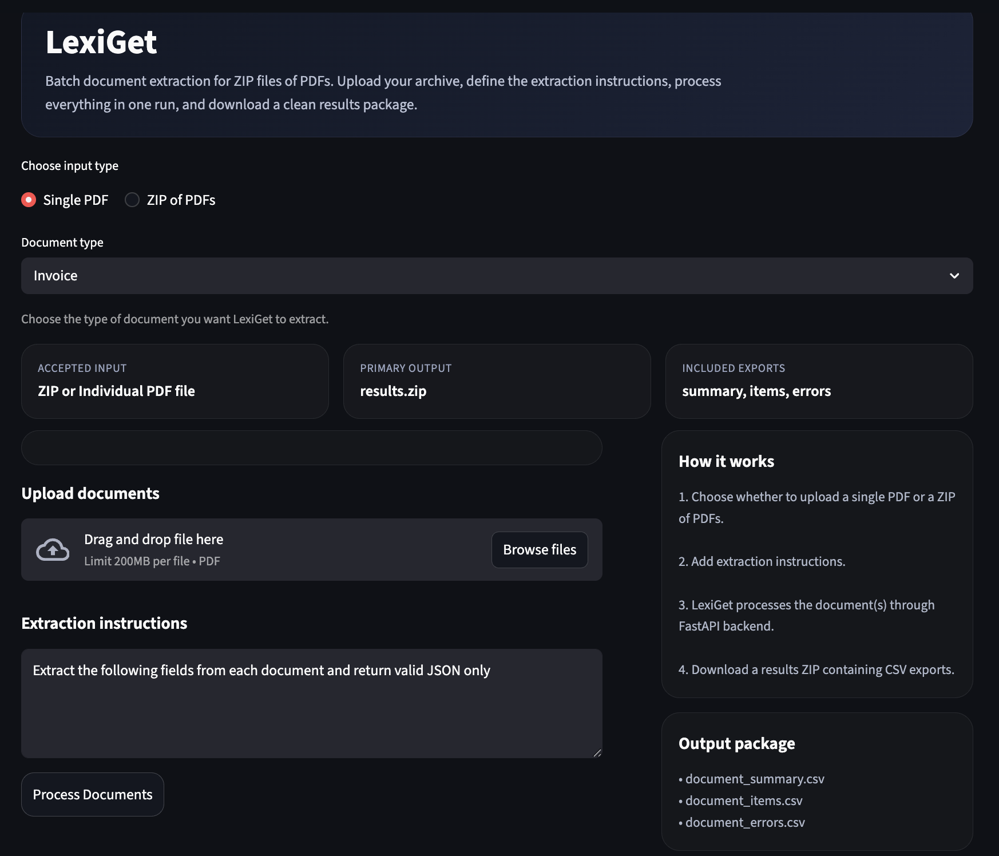

## LexiGet — AI Document Extraction System



LexiGet is an AI-powered system for extracting structured data from business documents such as **invoices, receipts, delivery notes, and contracts**. It converts unstructured PDF documents into structured JSON and CSV outputs suitable for analytics and automation workflows.

The system combines **LLM-powered extraction**, schema validation, and batch processing to transform documents into structured datasets.

---

### Features

- Extract structured data from **Invoices**
- Extract structured data from **Receipts**
- Extract structured data from **Delivery Notes**
- Extract structured data from **Contracts**
- Upload a **single PDF** or **ZIP of PDFs**
- Schema-enforced JSON outputs
- Automatic CSV generation
- Batch document processing
- Streamlit web interface
- FastAPI backend

---

### System Architecture

The extraction pipeline works as follows:

```
PDF / ZIP Upload
↓
Text Extraction (pdfplumber)
↓
Text Chunking + Ranking
↓
LLM Document Extraction
↓
Schema Validation (Pydantic)
↓
Structured JSON
↓
CSV Export
```


---

### Example Output

#### Extracted JSON

```json
{
  "invoice_number": "INV-001",
  "invoice_date": "2024-03-12",
  "currency": "USD",
  "total_amount": 1200,
  "seller": {
    "name": "Example Company"
  },
  "buyer": {
    "name": "Client Ltd"
  },
  "items": [
    {
      "name": "Product A",
      "unit_cost": 100,
      "quantity": 5,
      "total": 500
    }
  ]
}
```

### CSV Export

LexiGet generates three CSV outputs:

- document_summary.csv
- document_items.csv
- document_errors.csv

Example summary columns:

- filename
- invoice_number
- invoice_date
- currency
- total_amount
- seller_name
- buyer_name

Example items columns:

- filename
- invoice_number
- item_index
- item_name
- item_quantity
- item_unit_cost
- item_total

---

### User Interface

LexiGet provides a Streamlit web interface where users can:

- Upload a PDF or ZIP file
- Select document type
- Process documents
- Download extracted results as CSV

---

### Project Structure
```
lexiget
│
├── src/app
│   ├── main.py
│   ├── extractor.py
│   ├── llm.py
│   ├── schemas.py
│   └── csv_export.py
│
├── ui
│   └── lexiget_ui.py
│
├── samples
│   ├── invoice_sample.pdf
│   ├── receipt_sample.pdf
│   └── delivery_note_sample.pdf
│
├── requirements.txt
└── README.md
```
---

### Installation

Clone the repository:

```
git clone https://github.com/fonyango/lexiget.git
cd lexiget
```

Install dependencies:

`pip install -r requirements.txt`

### Running the Backend

#### Set up model from ollama

Download ollama

`curl -fsSL https://ollama.com/install.sh | sh`

Download model

`ollama pull mistral`

Start ollama server

`ollama serve`

#### Start the FastAPI server

`uvicorn src.app.main:app --reload`

The backend will run at `http://localhost:8000`

### Running the UI

Start the Streamlit interface:

`streamlit run ui/lexiget_ui.py`

The UI will open at `http://localhost:8501`

--- 
### Usage

- Upload a PDF or ZIP of documents
- Select document type
- Click Process Documents
- Download the generated results ZIP containing CSV files


LexiGet can be used for:

- Accounts payable automation
- Financial data extraction
- Document digitization
- Business process automation
- Data pipeline ingestion

---

### Future Improvements

- OCR support for scanned documents
- Automatic document type detection
- Confidence scores for extracted fields
- Excel export
- Async batch processing

--- 

### License


